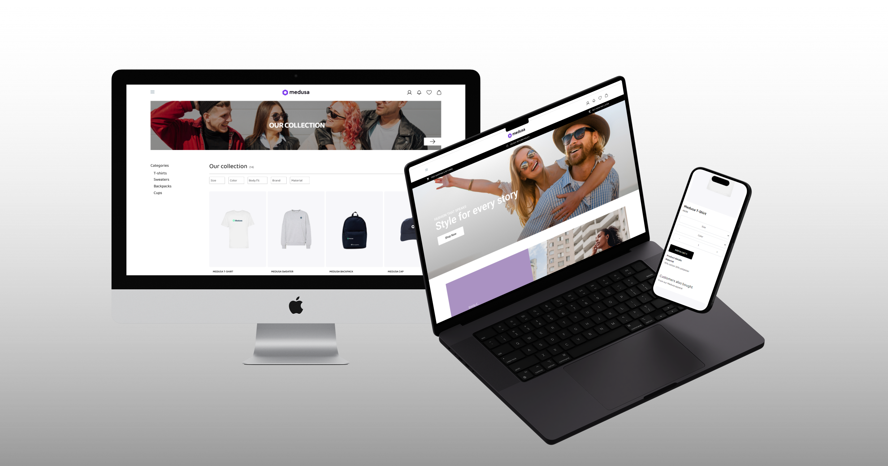

# Medusa Webshop

## Short Description
This project is a React TypeScript application styled with Tailwind CSS. It includes a homepage acting as a landing page, a product listing page with filtering and collection selection features, and a product detail page where users can customize their orders by selecting size, color, and quantity.

## Most Challenging Implementation
The most challenging part of the project was integrating and becoming used to Tailwind CSS. As it was my first time using Tailwind, I needed to educate myself on its approach to styling components and adapting to utility-first CSS methodology.

## Implementation You Are Most Proud Of
I am particularly proud of the product detail page implementation. It allows users to dynamically select product options like size, color, and quantity, updating the order details in real-time. Implementing this feature required integrating state management effectively and ensuring a smooth user experience.

## Time Spent
I spent approximately 4 days on this project, totaling around 20-24 hours of work.

## Project Structure
- **Folders and Files**: The project is organized into components, pages, and utilities folders, following a modular structure.
**Shared Layout**: A shared layout component (`Layout.tsx`) is implemented to maintain consistent header, footer, and navigation across all pages.
- **Technologies Used**: React, TypeScript, Tailwind CSS, React Router for navigation.
- **Considerations**: During development, I focused on creating reusable components, maintaining clean and readable code, and optimizing performance where possible.